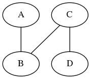
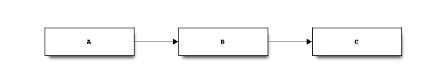
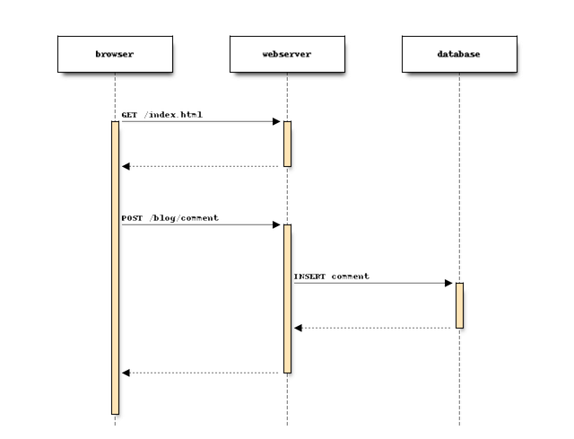
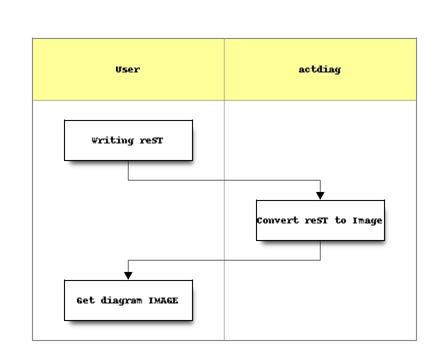
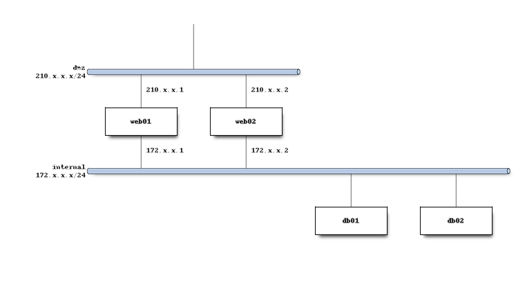
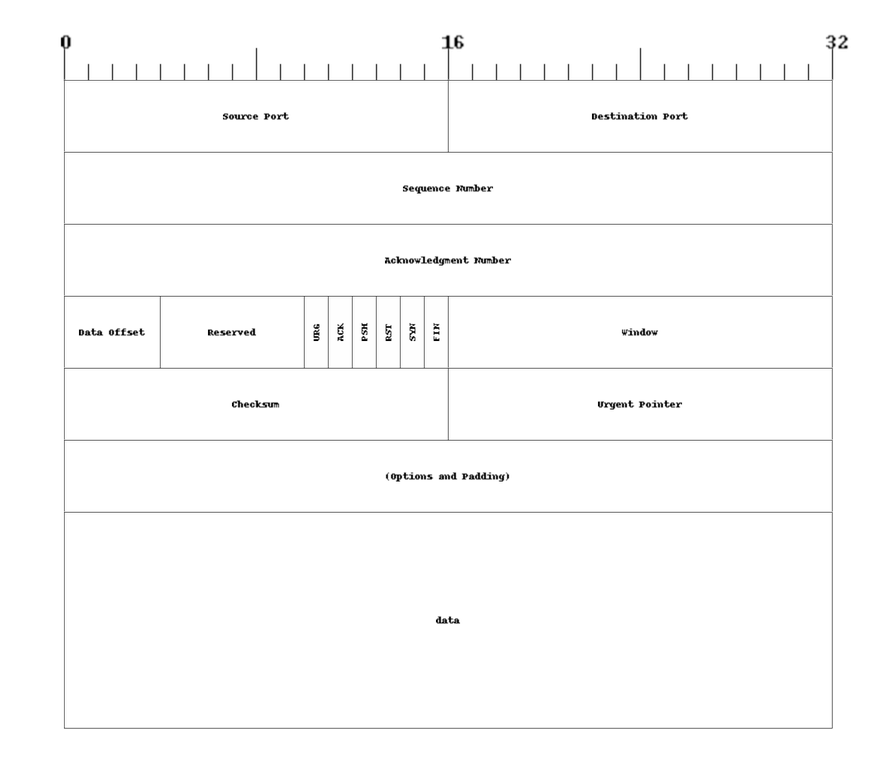
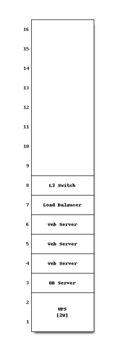
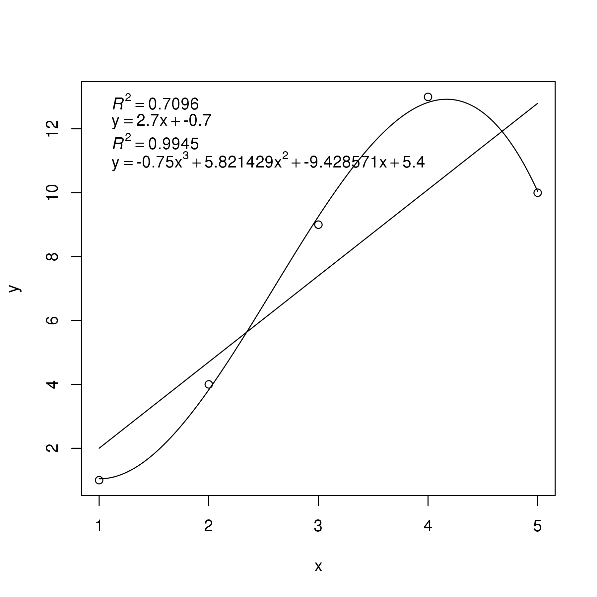
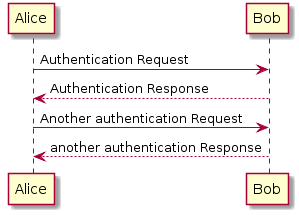

# VimPreviewPandoc

## Introduction

VimPreviewPandoc is VIM plugin that helps you with editing MarkDown-like documents.

Edit your MarkDown documents in VIM and see a nice HTML-based output in Konqueror or Firefox.
The web browser always shows changed area so you don't need to scroll manually.

## Features

 - Preview your markdown documents with Konqueror or Firefox

    - Scroll browser's view to show changed area automatically
    - Generate `dot` graphs with `graphviz`
    - Generate `blockdiag`, `seqdiag`, `actdiag`, `nwdiag`, `packetdiag`, `rackdiag` graphs
    - Generate `R` graphs

 - Show structural diff of specified file between specified git revisions

    - `:call VimPreviewPandocGitDiff(expand("%"), "HEAD~5", "HEAD")`
    - `:Unite giti/log`, a (action), *diff_pandoc_preview*

 - Generate output document in specified output format

    `:call VimPreviewPandocConvertTo("docx,html")`

## TODO

 - Add support for http://ditaa.sourceforge.net ascii art image convertor
 - Add support for http://plantuml.sourceforge.net uml creator

## Examples

### *DOT* Graph

This *DOT* code is shown as the following picture in the preview window:

    ```dot
    graph {
    A -- B
    C -- B
    C -- D
    }
    ```



### *Blockdiag* Graph

This *DOT* code is shown as the following picture in the preview window:

    ```blockdiag
    blockdiag {
    A -> B -> C
    }
    ```



### *Seqdiag* Graph

This *Seqdiag* code is shown as the following picture in the preview window:

    ```seqdiag
    seqdiag {
      browser  -> webserver [label = "GET /index.html"];
      browser <-- webserver;
      browser  -> webserver [label = "POST /blog/comment"];
                  webserver  -> database [label = "INSERT comment"];
                  webserver <-- database;
      browser <-- webserver;
    }
    ```



### *Actdiag* Graph

This *Actdiag* code is shown as the following picture in the preview window:

    ```actdiag
    actdiag {
      write -> convert -> image

      lane user {
         label = "User"
         write [label = "Writing reST"];
         image [label = "Get diagram IMAGE"];
      }
      lane actdiag {
         convert [label = "Convert reST to Image"];
      }
    }
    ```



### *Nwdiag* Graph

This *Nwdiag* code is shown as the following picture in the preview window:

    ```nwdiag
    nwdiag {
      network dmz {
          address = "210.x.x.x/24"

          web01 [address = "210.x.x.1"];
          web02 [address = "210.x.x.2"];
      }
      network internal {
          address = "172.x.x.x/24";

          web01 [address = "172.x.x.1"];
          web02 [address = "172.x.x.2"];
          db01;
          db02;
      }
    }
    ```



### *Packetdiag* Graph

This *Packetdiag* code is shown as the following picture in the preview window:

    ```packetdiag
    {
      colwidth = 32
      node_height = 72

      0-15: Source Port
      16-31: Destination Port
      32-63: Sequence Number
      64-95: Acknowledgment Number
      96-99: Data Offset
      100-105: Reserved
      106: URG [rotate = 270]
      107: ACK [rotate = 270]
      108: PSH [rotate = 270]
      109: RST [rotate = 270]
      110: SYN [rotate = 270]
      111: FIN [rotate = 270]
      112-127: Window
      128-143: Checksum
      144-159: Urgent Pointer
      160-191: (Options and Padding)
      192-223: data [colheight = 3]
    }
    ```



### *Rackdiag* Graph

This *Rackdiag* code is shown as the following picture in the preview window:

    ```rackdiag
    rackdiag {
      // define height of rack
      16U;

      // define rack items
      1: UPS [2U];
      3: DB Server
      4: Web Server
      5: Web Server
      6: Web Server
      7: Load Balancer
      8: L3 Switch
    }
    ```



### *R* Graph

This *R* code is shown as the following picture in the preview window:

    ```R
    y <- c(1,4,9,13,10)
    x <- c(1,2,3,4, 5 )
    xx <- seq(1, 5, length.out=250)

    plot(x, y)

    fit <- lm(y~x)
    label1 <- bquote(italic(R)^2 == .(format(summary(fit)$adj.r.squared, digits=4)))
    lines(xx, predict(fit, data.frame(x=xx)))
    fnc1 <- bquote(y == .(coef(fit)[[2]]) * x + .(coef(fit)[[1]]))


    fit <- lm(y~poly(x,3, raw = TRUE))
    label2 <- bquote(italic(R)^2 == .(format(summary(fit)$adj.r.squared, digits=4)))
    lines(xx, predict(fit, data.frame(x=xx)))
    fnc2 <- bquote(y == .(coef(fit)[[4]]) * x^3 + .(coef(fit)[[3]]) * x^2 + .(coef(fit)[[2]]) * x + .  (coef(fit)[[1]]))

    labels <- c(label1, fnc1, label2, fnc2)
    legend("topleft", bty="n", legend=as.expression(labels))
    ```



### PlantUML

This *PlantUML* code is shown as the following picture in the preview window:

    ```plantuml
    @startuml
    Alice -> Bob: Authentication Request
    Bob --> Alice: Authentication Response

    Alice -> Bob: Another authentication Request
    Alice <-- Bob: another authentication Response
    @enduml
    ```



## Installation

Install this plugin either manually or using any plugin manager (Vundle, NeoBundle, ...).

I also recommend you to install the following plugins to extend pandoc support:

- [vim-pantondoc](https://github.com/vim-pandoc/vim-pantondoc)
- [vim-pandoc-syntax](https://github.com/vim-pandoc/vim-pandoc-syntax.git)
- [vim-pandoc-after](https://github.com/vim-pandoc/vim-pandoc-after.git)

Add `autocmd BufNewFile,BufRead *.md set filetype=pandoc` to your `.vimrc` if not using `vim-pantondoc` which sets it.

Place your VIM on one side of your screen and manually start a web browser on the other side to get productive environment.

Konqueror shows automatically correct preview. With Firefox you have to manually open `static/index.html` for first time.

## Dependencies

 - VIM with Python2 support
 - pandoc *1.12.3.3*
 - pyhton2 [pandocfilters](https://github.com/jgm/pandocfilters)

### Structural diff support

 - python2 [htmltreediff](https://github.com/PolicyStat/htmltreediff.git)
 - optionally [unite.vim](https://github.com/Shougo/unite.vim.git) with [vim-unite-giti](https://github.com/kmnk/vim-unite-giti.git)

### Dot graph support

 - [graphviz](http://www.graphviz.org)

### Diag-family graphs support

 - [blockdiag](http://blockdiag.com/en/blockdiag/index.html)
 - [seqdiag](http://blockdiag.com/en/seqdiag/index.html)
 - [actdiag](http://blockdiag.com/en/actdiag/index.html)
 - [nwdiag](http://blockdiag.com/en/nwdiag/index.html)

### R graph support

 - [R](http://r-project.org)

### Konqueror

 - Konqueror (tested with version *4.13.0*)
 - python2 dbus

### Firefox

 - Firefox
 - [Remote Control extension](https://addons.mozilla.org/en-US/firefox/addon/remote-control)

## Unite.vim integration

Add the following code to your *.vimrc* to add *diff_pandoc_preview* action to *vim-unite-giti*'s *giti-log*.

```vimrc
if neobundle#tap("unite.vim")
            \ && neobundle#tap("vim-unite-giti")
            \ && neobundle#tap("vimpreviewpandoc")

    function! s:is_graph_only_line(candidate)
        return has_key(a:candidate.action__data, 'hash') ? 0 : 1
    endfunction

    let s:pandoc_diff_action = {
        \ 'description' : 'pandoc diff with vimpreviewpandoc',
        \ 'is_selectable' : 1,
        \ 'is_quit' : 1,
        \ 'is_invalidate_cache' : 0,
        \ }
    function! s:pandoc_diff_action.func(candidates)
        if s:is_graph_only_line(a:candidates[0])
                    \ || len(a:candidates) > 1 && s:is_graph_only_line(a:candidates[1])
            call giti#print('graph only line')
            return
        endif

        let from  = ''
        let to    = ''
        let file  = len(a:candidates[0].action__file) > 0
                    \               ? a:candidates[0].action__file
                    \               : expand('%:p')
        let relative_path = giti#to_relative_path(file)
        if len(a:candidates) == 1
            let to   = a:candidates[0].action__data.hash
            let from = a:candidates[0].action__data.parent_hash
        elseif len(a:candidates) == 2
            let to   = a:candidates[0].action__data.hash
            let from = a:candidates[1].action__data.hash
        else
            call unite#print_error('too many commits selected')
            return
        endif

        call VimPreviewPandocGitDiff({
                    \   'file' : relative_path,
                    \   'from' : from,
                    \   'to'   : to,
                    \ })
    endfunction

    call unite#custom#action('giti/log', 'diff_pandoc_preview', s:pandoc_diff_action)
    unlet s:pandoc_diff_action

endif
```

## Theory of operation

 `BufwinEnter`, `CursorHold,CusrsorHildI` events execute the following:

 - `pandoc` to convert MarkDown document to HTML

    - custom filter to create a `graphviz` graphs from *dot* code blocks
    - custom filter to create a `blockdiag`, `seqdiag`, `actdiag`, `nwdiag`, `packetdiag`, `rackdiag` graphs from *blockdiag*, *seqdiag*, *actdiag*, *nwdiag*, *packetdiag*, *rackdiag* blocks
    - custom filter to create a `R` generated graphs from *R* code blocks
    - custom filter to replace relative paths to images to absolute paths

    - Konqueror

        - `DBUS` to control Konqueror
        - open `static/index.html` if not already opened
        - pass pandoc output to the Konqueror using `DBUS` call `org.kde.KHTMLPart.evalJS`

    - Firefox

        - `Remote Control` extension to control Firefox
        - pass pandoc output to the Firefox using `Remote Control` (TCP socket, default parameters)

        Both browsers evaluate JavaScript functions `setCursor(word, count)` where word and count is encoded position and `setOutput(html)` where html is output from pandoc

 - index.html is empty page with `setCursor(word, count)` `setOutput(html)` functions

     - `setCursor(word, count)` finds the encoded position and scrolls window to it
     - `setOutput(html)` replaces the content of the `div` with a new one
