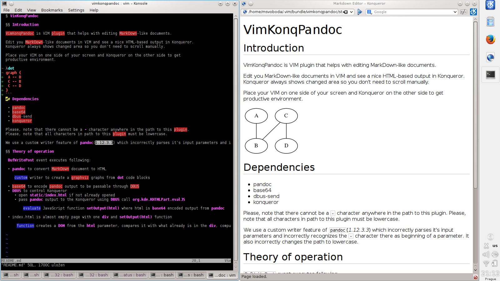

# VimPreviewPandoc

## Introduction

VimPreviewPandoc is VIM plugin that helps you with editing MarkDown-like documents.

Edit your MarkDown documents in VIM and see a nice HTML-based output in Konqueror or Firefox.
The web browser always shows changed area so you don't need to scroll manually.

## Features

 - Previews your markdown documents with Konqueror or Firefox
 - Scrolls browser's view to show changed area automatically
 - Generate `dot` graphs with `graphviz`
 - `:call VimPreviewPandocGitDiff("HEAD~5", "HEAD")` shows diff of specified git revisions

## Installation

Install this plugin either manually or using any plugin manager (Vundle, NeoBundle, ...).

I also recommend you to install the following plugins to extend pandoc support:

- [vim-pantondoc](https://github.com/vim-pandoc/vim-pantondoc)
- [vim-pandoc-syntax](https://github.com/vim-pandoc/vim-pandoc-syntax.git)
- [vim-pandoc-after](https://github.com/vim-pandoc/vim-pandoc-after.git)

Add `autocmd BufNewFile,BufRead *.md set filetype=pandoc` to your `.vimrc` if not using `vim-pantondoc` which sets it.

Place your VIM on one side of your screen and start manually web browser on the other side to get
productive environment.

Konqueror shows automatically correct preview. With Firefox you have to manually open `static/index.html` for first time.

## Dependencies

 - VIM with Python2 support
 - [vimproc](https://github.com/Shougo/vimproc)
 - pandoc *1.12.3.3*
 - [pandocfilters](https://github.com/jgm/pandocfilters)
 - [graphviz](http://www.graphviz.org)
 - git, for git-diff
 - [htmltreediff](https://github.com/PolicyStat/htmltreediff.git)

### Konqueror

 - Konqueror *4.13.0*
 - python2 dbus

### Firefox

 - Firefox
 - [Remote Control extension](https://addons.mozilla.org/en-US/firefox/addon/remote-control)

## Theory of operation

 `BufWritePost`, `CursorHold,CusrsorHildI`, `TextChanged, TextChangedI` events execute the following:

 - `git-diff` to create a word granularity diff

 - pandoc to convert MarkDown diff document to HTML

    - custom filter to create a graphviz graphs from `dot` code blocks
    - custom filter to replace relative paths to images to absolute paths

 - `htmltreediff` to create structure aware html diff

    - Konqueror

        - `DBUS` to control Konqueror
        - open `static/index.html` if not already opened
        - pass pandoc output to the Konqueror using `DBUS` call `org.kde.KHTMLPart.evalJS`

    - Firefox

        - `Remote Control` extension to control Firefox
        - pass pandoc output to the Firefox using `Remote Control` (TCP socket, default parameters)

        Both browsers evaluate JavaScript function `setOutput(html)` where html is `base64` encoded output from pandoc

 - index.html is empty page with one `div` and `setOutput(html)` function

     - finds first occurrence of `ins` or `del` tag
     - scrolls window to it

