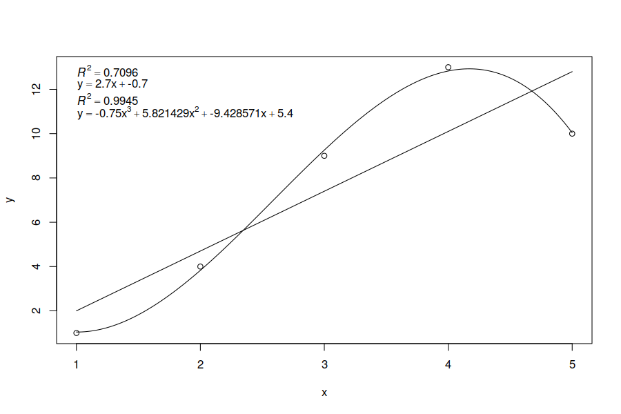
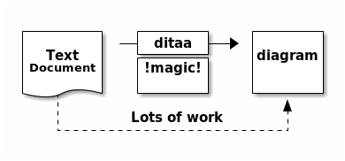

# VimPreviewPandoc

## Introduction

VimPreviewPandoc is VIM plugin that helps you with editing MarkDown-like documents.

Edit your MarkDown documents in VIM and see a nice `pandoc` generated output in `epiphany`.
Output in `epiphany` is updated automatically always when the document is saved.

## Features

 - Preview your MarkDown documents with `epiphany`

    - :call vimpreviewpandoc#PreviewForce() to open `epiphany` if it was closed manually

    - Automatically opens `epiphany` when a markdown document is opened
    - Automatically refreshes `pandoc` generated output when document is saved

    - Generate `dot` graphs with `graphviz`
    - Generate `blockdiag`, `seqdiag`, `actdiag`, `nwdiag`, `packetdiag`, `rackdiag` graphs
    - Generate `R` graphs
    - Generate PlantUML graphs
    - Generate ASCII art based images with `ditaa`
    - Generate images with `pikchr`

 - Generate output document in specified output format

    - `:call vimpreviewpandoc#ConvertTo("docx,html")`

## Examples

### *DOT* Graph

This *DOT* code is shown as the following picture in the preview window:

    ```dot
    graph {
    A -- B
    C -- B
    C -- D
    }
    ```


### *Blockdiag* Graph

This *DOT* code is shown as the following picture in the preview window:

    ```blockdiag
    blockdiag {
    A -> B -> C
    }
    ```


### *Seqdiag* Graph

This *Seqdiag* code is shown as the following picture in the preview window:

    ```seqdiag
    seqdiag {
      browser  -> webserver [label = "GET /index.html"];
      browser <-- webserver;
      browser  -> webserver [label = "POST /blog/comment"];
                  webserver  -> database [label = "INSERT comment"];
                  webserver <-- database;
      browser <-- webserver;
    }
    ```


### *Actdiag* Graph

This *Actdiag* code is shown as the following picture in the preview window:

    ```actdiag
    actdiag {
      write -> convert -> image

      lane user {
         label = "User"
         write [label = "Writing reST"];
         image [label = "Get diagram IMAGE"];
      }
      lane actdiag {
         convert [label = "Convert reST to Image"];
      }
    }
    ```


### *Nwdiag* Graph

This *Nwdiag* code is shown as the following picture in the preview window:

    ```nwdiag
    nwdiag {
      network dmz {
          address = "210.x.x.x/24"

          web01 [address = "210.x.x.1"];
          web02 [address = "210.x.x.2"];
      }
      network internal {
          address = "172.x.x.x/24";

          web01 [address = "172.x.x.1"];
          web02 [address = "172.x.x.2"];
          db01;
          db02;
      }
    }
    ```


### *Packetdiag* Graph

This *Packetdiag* code is shown as the following picture in the preview window:

    ```packetdiag
    {
      colwidth = 32
      node_height = 72

      0-15: Source Port
      16-31: Destination Port
      32-63: Sequence Number
      64-95: Acknowledgment Number
      96-99: Data Offset
      100-105: Reserved
      106: URG [rotate = 270]
      107: ACK [rotate = 270]
      108: PSH [rotate = 270]
      109: RST [rotate = 270]
      110: SYN [rotate = 270]
      111: FIN [rotate = 270]
      112-127: Window
      128-143: Checksum
      144-159: Urgent Pointer
      160-191: (Options and Padding)
      192-223: data [colheight = 3]
    }
    ```


### *Rackdiag* Graph

This *Rackdiag* code is shown as the following picture in the preview window:

    ```rackdiag

    rackdiag {
      // define height of rack
      16U;

      // define rack items
      1: UPS [2U];
      3: DB Server
      4: Web Server
      5: Web Server
      6: Web Server
      7: Load Balancer
      8: L3 Switch
    }
    ```


### *R* Graph

This *R* code is shown as the following picture in the preview window:

    ```{.r #whatever width=9 height=6 caption="R generated output"}
                                  
    y <- c(1,4,9,13,10)     
    x <- c(1,2,3,4, 5 )
    xx <- seq(1, 5, length.out=250)
           
    plot(x, y)

    fit <- lm(y~x)
    label1 <- bquote(italic(R)^2 == .(format(summary(fit)$adj.r.squared, digits=4)))
    lines(xx, predict(fit, data.frame(x=xx)))
    fnc1 <- bquote(y == .(coef(fit)[[2]]) * x + .(coef(fit)[[1]]))

             
    fit <- lm(y~poly(x,3, raw = TRUE))
    label2 <- bquote(italic(R)^2 == .(format(summary(fit)$adj.r.squared, digits=4)))
    lines(xx, predict(fit, data.frame(x=xx)))
    fnc2 <- bquote(y == .(coef(fit)[[4]]) * x^3 + .(coef(fit)[[3]]) * x^2 + .(coef(fit)[[2]]) * x + .  (coef(fit)[[1]]))

    labels <- c(label1, fnc1, label2, fnc2)
    legend("topleft", bty="n", legend=as.expression(labels))
    ```



### PlantUML

This *PlantUML* code as the following picture in the preview window:

    ```plantuml
    @startuml
    Alice -> Bob: Authentication Request
    Bob --> Alice: Authentication Response

    Alice -> Bob: Another authentication Request
    Alice <-- Bob: another authentication Response
    @enduml
    ```


### Ditaa

This *Ditaa* code is shown as the following picture in the preview window:

    ```ditaa
    +--------+   +-------+    +-------+
    |        | --+ ditaa +--> |       | 
    |  Text  |   +-------+    |diagram|
    |Document|   |!magic!|    |       |
    |     {d}|   |       |    |       |
    +---+----+   +-------+    +-------+
        :                         ^
        |       Lots of work      |
        +-------------------------+
    ```



### Pikchr

    ``` pikchr
    arrow right 200% "Markdown" "Source"
    box rad 10px "Markdown" "Formatter" "(markdown.c)" fit
    arrow right 200% "HTML+SVG" "Output"
    arrow <-> down 70% from last box.s
    box same "Pikchr" "Formatter" "(pikchr.c)" fit
    ```


## Installation

Install this plugin either manually or using any plugin manager (Vundle, NeoBundle, Plug...).

Make sure that python scripts in *python* folder (pre.py, blockdiag.py, ...) needs to have executable bit set. This is required by `pandoc` to read its shebang and execute it with python version as specified with the shebang.

Those plugins are required:

- [async.vim](https://github.com/prabirshrestha/async.vim.git)

I also recommend you to install the following plugins to extend `pandoc` support:

- [vim-pandoc](https://github.com/vim-pandoc/vim-pandoc)
- [vim-pandoc-syntax](https://github.com/vim-pandoc/vim-pandoc-syntax.git)
- [vim-pandoc-after](https://github.com/vim-pandoc/vim-pandoc-after.git)

Place your VIM on one side of your screen and when `epiphany` appears, move it to the other side to get productive environment.

## Dependencies

 - pandoc *1.12.3.3* and newer
 - python3 [pandocfilters](https://github.com/jgm/pandocfilters)
 - [Epiphany](https://wiki.gnome.org/Apps/Web)

 - [graphviz](http://www.graphviz.org)
 - [blockdiag](http://blockdiag.com/en/blockdiag/index.html)
 - [seqdiag](http://blockdiag.com/en/seqdiag/index.html)
 - [actdiag](http://blockdiag.com/en/actdiag/index.html)
 - [nwdiag](http://blockdiag.com/en/nwdiag/index.html)
 - [R](http://r-project.org)
 - [PlantUML](https://github.com/plantuml/plantuml)
 - [Ditaa](https://github.com/stathissideris/ditaa.git)
 - [pikchr](https://pikchr.org/home/doc/trunk/homepage.md)
